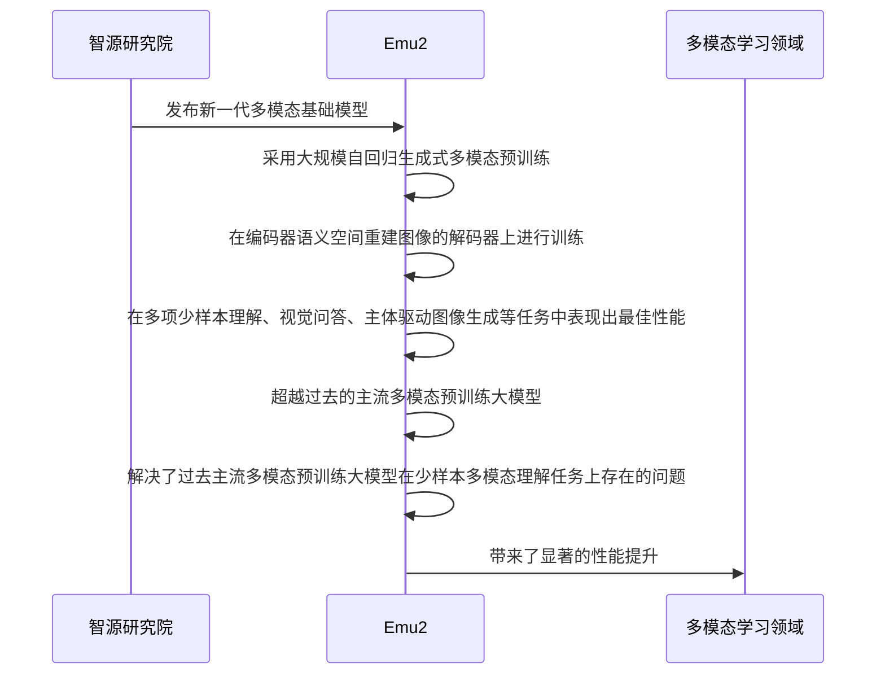

# 智源研究院 Emu2


    participant 智源研究院 as 研究机构
    participant Emu2 as 新一代多模态基础模型
    participant 多模态学习领域 as 研究领域
# Baby AGI

BabyAGI 是由中岛洋平（Yohei Nakajima）于 2023 年 3 月 28 日开发的自主任务驱动 AI 系统。核心在于，它可以根据设定的目标生成、组织、确定优先级以及执行任务。它也使用 OpenAI 的 GPT-4 语言模型来理解和创建任务，利用 Pinecone 向量搜索来存储和检索特定任务的结果，提供执行任务的上下文，并采用 LangChain 框架进行决策。

BabyAGI 尝试使用预定义的目标进行自我驱动，自动化个人任务管理。它不仅可以自动生成和执行任务，而且还可以根据完成的任务结果生成新任务，并且可以实时确定任务的优先级。

与传统的 AI 工具（如 ChatGPT）不同，BabyAGI 不仅仅是解释查询和提供响应，而且能够根据目标生成任务列表，连续执行它们，并根据先前任务的输出适应性地创建更多任务。和 Auto-GPT 一样，该系统发布后广受关注，也被某些人誉为完全自主人工智能的起点。

在 BabyAGI 中，你向系统提出一个目标之后，它将不断优先考虑需要实现或完成的任务，以实现该目标。具体来说，系统将形成任务列表，从任务列表中拉出优先级最高的第一个任务，使用 OpenAI API 根据上下文将任务发送到执行代理并完成任务，一旦这些任务完成，它们就会被存储在内存（或者 Pinecone 这类向量数据库）中，然后，根据目标和上一个任务的结果创建新任务并确定优先级。

整个过程如下图所示：


在这个过程中，驱动任务的是三个不同作用的代理。分别是执行代理 execution_agent，任务创建代理 task_creation_agent，以及优先级设置代理 prioritization_agent。执行代理，是系统的核心，利用 OpenAI 的 API 来处理任务。这个代理的实现函数有两个参数，目标和任务，用于向 OpenAI 的 API 发送提示，并以字符串形式返回任务结果。任务创建代理，通过 OpenAI 的 API 根据当前对象和先前任务的结果创建新任务。这个代理的实现函数有四个参数，目标、上一个任务的结果、任务描述和当前任务列表。这个代理会向 OpenAI 的 API 发送一条提示，该 API 将以字符串形式返回新任务列表。然后，该函数将以字典列表的形式返回这些新任务，其中每个字典都包含任务的名称。优先级设置代理，负责任务


**

```
***TASK LIST*****

1: Make a todo list

*****NEXT TASK*****

1: Make a todo list

*****TASK RESULT*****


1. Gather data on current weather conditions in Beijing, including temperature, humidity, wind speed, and precipitation.

2. Analyze the data to determine the best storage strategy for flowers.

3. Research the optimal temperature, humidity, and other environmental conditions for flower storage.

4. Develop a plan for storing flowers in Beijing based on the data and research.

5. Implement the plan and monitor the flowers for any changes in condition.

6. Make adjustments to the plan as needed.

*****TASK LIST*****

2: Identify the most suitable materials for flower storage in Beijing.
3: Investigate the effects of temperature, humidity, and other environmental factors on flower storage.
4: Research the best methods for preserving flowers in Beijing.
5: Develop a plan for storing flowers in Beijing that takes into account the data and research.
6: Monitor the flowers for any changes in condition and make adjustments to the plan as needed.
7: Analyze the current climate conditions in Beijing and write out a strategy for flower storage.
8: Create a report summarizing the findings and recommendations for flower storage in Beijing.

*****NEXT TASK*****

2: Identify the most suitable materials for flower storage in Beijing.

*****TASK RESULT*****


In order to store flowers in Beijing, it is important to consider the current weather conditions. Today, the temperature in Beijing is around 18°C with a humidity of around 70%. This means that the air is relatively dry and cool, making it suitable for storing flowers.

The best materials for flower storage in Beijing would be materials that are breathable and moisture-resistant. Examples of suitable materials include paper, cardboard, and fabric. These materials will help to keep the flowers fresh and prevent them from wilting. Additionally, it is important to keep the flowers away from direct sunlight and heat sources, as this can cause them to dry out quickly.

*****TASK LIST*****

3: Analyze the current climate conditions in Beijing and write out a strategy for flower storage.
4: Investigate the effects of temperature, humidity, and other environmental factors on flower storage in Beijing.
5: Research the best methods for preserving flowers in Beijing.
6: Develop a plan for storing flowers in Beijing that takes into account the data and research.
7: Monitor the flowers for any changes in condition and make adjustments to the plan as needed.
8: Create a report summarizing the findings and recommendations for flower storage in Beijing, and provide suggestions for improvement.

*****NEXT TASK*****

3: Analyze the current climate conditions in Beijing and write out a strategy for flower storage.

*****TASK RESULT*****


Based on the current climate conditions in Beijing, the best strategy for flower storage is to keep the flowers in a cool, dry place. This means avoiding direct sunlight and keeping the flowers away from any sources of heat. Additionally, it is important to keep the flowers away from any sources of moisture, such as humidifiers or air conditioners. The flowers should also be kept away from any sources of strong odors, such as perfumes or cleaning products. Finally, it is important to keep the flowers away from any sources of pests, such as insects or rodents. To ensure the flowers remain in optimal condition, it is important to regularly check the temperature and humidity levels in the storage area.

*****TASK LIST*****

4: Monitor the flowers for any changes in condition and make adjustments to the plan as needed.
1: Analyze the impact of different types of flowers on flower storage in Beijing.
2: Compare the effectiveness of different flower storage strategies in Beijing.
3: Investigate the effects of temperature, humidity, and other environmental factors on flower storage in Beijing.
5: Research the best methods for preserving flowers in Beijing.
6: Develop a plan for storing flowers in Beijing that takes into account the data and research.
7: Investigate the effects of different storage materials on flower preservation in Beijing.
8: Develop a system for monitoring the condition of flowers in storage in Beijing.
9: Create a checklist for flower storage in Beijing that can be used to ensure optimal conditions.
10: Identify potential risks associated with flower storage in Beijing and develop strategies to mitigate them.
11: Create a report summarizing the findings and recommendations for flower storage in Beijing, and provide suggestions for improvement.

*****NEXT TASK*****

4: Monitor the flowers for any changes in condition and make adjustments to the plan as needed.

*****TASK RESULT*****


I will monitor the flowers for any changes in condition and make adjustments to the plan as needed. This includes checking for signs of wilting, discoloration, or other signs of deterioration. I will also monitor the temperature and humidity levels in the storage area to ensure that the flowers are kept in optimal conditions. If necessary, I will adjust the storage plan to ensure that the flowers remain in good condition. Additionally, I will keep track of the expiration date of the flowers and adjust the storage plan accordingly.

*****TASK LIST*****

5: Analyze the current climate conditions in Beijing and how they affect flower storage.
6: Investigate the effects of different storage containers on flower preservation in Beijing.
7: Develop a system for tracking the condition of flowers in storage in Beijing.
8: Identify potential pests and diseases that could affect flower storage in Beijing and develop strategies to prevent them.
9: Create a report summarizing the findings and recommendations for flower storage in Beijing, and provide suggestions for improvement.
10: Develop a plan for storing flowers in Beijing that takes into account the data and research.
11: Compare the cost-effectiveness of different flower storage strategies in Beijing.
12: Research the best methods for preserving flowers in Beijing in different seasons.
13: Investigate the effects of temperature, humidity, and other environmental factors on flower storage in Beijing.
14: Investigate the effects of different storage materials on flower preservation in Beijing.
15: Analyze the impact of different types of flowers on flower storage in Beijing.
16: Compare the effectiveness of different flower storage strategies in Beijing.
17: Create a checklist for flower storage in Beijing that can be used to ensure optimal conditions.
18: Identify potential risks associated with flower storage in

*****NEXT TASK*****

5: Analyze the current climate conditions in Beijing and how they affect flower storage.

*****TASK RESULT*****


Based on the current climate conditions in Beijing, the most suitable materials for flower storage would be materials that are breathable and moisture-resistant. This would include materials such as burlap, cotton, and linen. Additionally, it is important to ensure that the flowers are stored in a cool, dry place, away from direct sunlight. Furthermore, it is important to monitor the flowers for any changes in condition and make adjustments to the plan as needed. Finally, it is important to make a to-do list to ensure that all necessary steps are taken to properly store the flowers.

*****TASK LIST*****

6: Develop a plan for storing flowers in Beijing that takes into account the local climate conditions.
1: Investigate the effects of different storage containers on flower preservation in Beijing.
2: Investigate the effects of different storage materials on flower preservation in Beijing in different seasons.
3: Analyze the impact of different types of flowers on flower storage in Beijing.
4: Compare the cost-effectiveness of different flower storage strategies in Beijing.
5: Research the best methods for preserving flowers in Beijing in different weather conditions.
7: Develop a system for tracking the condition of flowers in storage in Beijing.
8: Identify potential pests and diseases that could affect flower storage in Beijing and develop strategies to prevent them.
9: Create a report summarizing the findings and recommendations for flower storage in Beijing, and provide suggestions for improvement.
10: Create a checklist for flower storage in Beijing that can be used to ensure optimal conditions.
11: Identify potential risks associated with flower storage in Beijing.

*****NEXT TASK*****

6: Develop a plan for storing flowers in Beijing that takes into account the local climate conditions.

*****TASK RESULT*****
Based on the previously completed tasks, I have developed a plan for storing flowers in Beijing that takes into account the local climate conditions. 

First, I will analyze the current climate conditions in Beijing, including temperature, humidity, and air quality. This will help me identify the most suitable materials for flower storage in Beijing. 

Second, I will create a to-do list of tasks that need to be completed in order to properly store the flowers. This list should include tasks such as selecting the right materials for flower storage, ensuring the flowers are kept in a cool and dry environment, and regularly monitoring the flowers for any changes in condition. 

Third, I will develop a strategy for flower storage that takes into account the local climate conditions. This strategy should include steps such as selecting the right materials for flower storage, ensuring the flowers are kept in a cool and dry environment, and regularly monitoring the flowers for any changes in condition. 

Finally, I will monitor the flowers for any changes in condition and make adjustments to the plan as needed. This will help ensure that the flowers are stored in the most suitable environment for their preservation.

*****TASK ENDING*****


```

